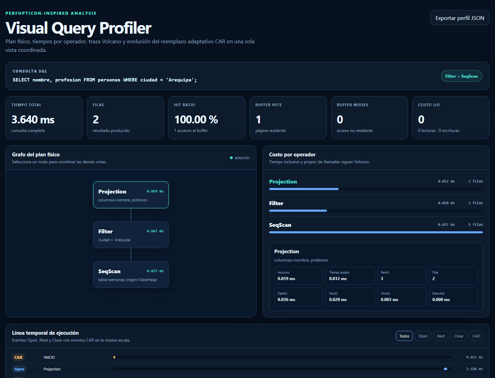
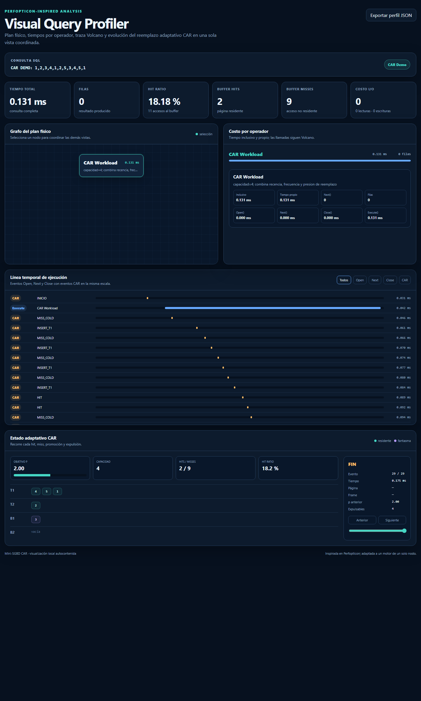
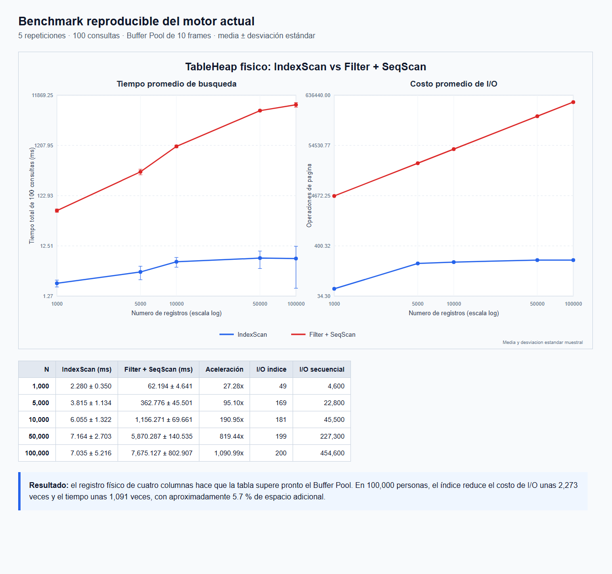

# Mini-SGBD CAR: motor paginado, consultas Volcano y análisis visual

Mini-SGBD educativo escrito en C++17 que integra almacenamiento binario por
páginas, Buffer Pool con reemplazo adaptativo CAR, índice hash extensible
persistente, ejecución de consultas con el Modelo Volcano, métricas de
rendimiento y un visualizador interactivo inspirado en Perfopticon.

El repositorio no es solamente una simulación del algoritmo de reemplazo:
ejecuta consultas SQL sobre registros físicos, usa el Buffer Pool para
acceder al archivo `.db`, persiste el índice como `id -> RID`, mide el costo
de cada consulta y conecta el plan físico con la evolución interna de CAR.



## Índice

1. [Resumen ejecutivo](#1-resumen-ejecutivo)
2. [Fundamento científico](#2-fundamento-científico)
3. [Alcance funcional logrado](#3-alcance-funcional-logrado)
4. [Arquitectura del sistema](#4-arquitectura-del-sistema)
5. [Motor de consultas](#5-motor-de-consultas)
6. [Visual Query Profiler](#6-visual-query-profiler)
7. [Manual de instalación y uso](#7-manual-de-instalación-y-uso)
8. [Experimentos y resultados](#8-experimentos-y-resultados)
9. [Evidencias y trazabilidad](#9-evidencias-y-trazabilidad)
10. [Matriz de alcance](#10-matriz-de-alcance)
11. [Estructura del repositorio](#11-estructura-del-repositorio)
12. [Trabajo futuro](#12-trabajo-futuro-priorizado)
13. [Conclusión](#13-conclusión)

---

## 1. Resumen ejecutivo

### Problema abordado

Un SGBD debe resolver simultáneamente tres problemas:

1. Organizar registros persistentes en páginas físicas.
2. Decidir qué páginas mantener en memoria cuando el Buffer Pool es limitado.
3. Explicar cómo una consulta declarativa se transforma en trabajo físico y
   costo de I/O.

Este proyecto aborda los tres problemas en un motor compacto y observable.
La propuesta une dos líneas de investigación:

- **reemplazo adaptativo de páginas**, sustentado por CAR;
- **análisis visual de consultas**, sustentado por Perfopticon.

### Resultado alcanzado

```text
SQL
 |
 v
Parser -> QueryExecutor -> Plan físico Volcano
                              |
             +----------------+----------------+
             |                                 |
             v                                 v
       IndexScan(id -> RID)             Filter + SeqScan
             |                                 |
             +---------------+-----------------+
                             |
                             v
                   TableHeap paginado
                             |
                             v
             BufferPoolManager + CARReplacer
                             |
                             v
                   DiskManager (.db)

Plan + tiempos + filas + hits/misses + I/O + eventos CAR
                             |
                             v
                 Visual Query Profiler HTML
```

### Estado verificable

| Área | Estado |
|---|---|
| Archivo binario y páginas de 4 KB | Implementado |
| Tabla física `personas` | Implementada |
| Catálogo persistente | Implementado, versión 3 |
| Buffer Pool | Implementado |
| CAR con T1/T2/B1/B2 y `p` | Implementado |
| Índice hash extensible persistente | Implementado |
| Índice físico `id -> RID` | Implementado |
| Modelo Volcano | Implementado |
| `SELECT`, `WHERE`, proyección | Implementados |
| `INSERT`, `UPDATE`, `DELETE` | Implementados |
| Profiler de tiempo, Buffer e I/O | Implementado |
| Grafo y trazas interactivas | Implementados |
| Persistencia después de reiniciar | Verificada |
| Benchmark estadístico | 50 observaciones regeneradas |
| Pruebas automatizadas | 12 suites aprobadas |

---

## 2. Fundamento científico

### 2.1 Paper 1: CAR

Referencia principal:

> Sorav Bansal y Dharmendra S. Modha.
> **CAR: Clock with Adaptive Replacement**.
> 3rd USENIX Conference on File and Storage Technologies, FAST 2004.

- Página oficial:
  <https://www.usenix.org/conference/fast-04/car-clock-adaptive-replacement>
- Paper:
  <https://www.usenix.org/events/fast04/tech/full_papers/bansal/bansal.pdf>

El paper parte de las limitaciones de CLOCK y LRU. CAR busca combinar:

- la baja complejidad y el uso de bits de referencia de CLOCK;
- la adaptación entre recencia y frecuencia inspirada en ARC;
- resistencia a escaneos que podrían contaminar la caché;
- ajuste en línea sin un parámetro fijo definido para una carga concreta.

CAR mantiene dos conjuntos residentes y dos historiales fantasma:

| Estructura | Significado |
|---|---|
| `T1` | páginas residentes asociadas principalmente con recencia |
| `T2` | páginas residentes asociadas principalmente con frecuencia |
| `B1` | historial fantasma de páginas expulsadas desde `T1` |
| `B2` | historial fantasma de páginas expulsadas desde `T2` |
| `p` | tamaño objetivo adaptable de la parte reciente |

Las listas fantasma no conservan los datos de la página. Conservan su
identidad para aprender del patrón de accesos posterior.

#### Adaptación de `p`

Un fallo que encuentra la página en `B1` indica que se expulsó demasiado
pronto una página reciente. La implementación incrementa `p`:

```text
p <- min(c, p + max(1, |B2| / |B1|))
```

Un fallo que encuentra la página en `B2` indica que debe reforzarse la parte
frecuente. La implementación reduce `p`:

```text
p <- max(0, p - max(1, |B1| / |B2|))
```

Donde `c` es la capacidad del reemplazador.

#### Correspondencia entre el paper y el código

| Concepto de CAR | Implementación del proyecto |
|---|---|
| páginas residentes recientes | `t1_` |
| páginas residentes frecuentes | `t2_` |
| historial fantasma reciente | `b1_` |
| historial fantasma frecuente | `b2_` |
| parámetro adaptativo | `p_` |
| bit de referencia CLOCK | `FrameEntry::reference_bit` |
| segunda oportunidad | rotación en `Victim()` |
| promoción reciente a frecuente | `PROMOTE_T1_T2` |
| hit fantasma en B1 | `MISS_B1` e incremento de `p` |
| hit fantasma en B2 | `MISS_B2` y reducción de `p` |
| límites de los historiales | `TrimGhostLists()` |

La implementación usa listas enlazadas como relojes lógicos: toma el
elemento frontal, inspecciona su bit de referencia y lo elimina, promueve o
reubica al final según corresponda.

#### Extensiones necesarias para integrarlo a un SGBD

Además de la lógica descrita por CAR, el motor incorpora:

- relación entre `page_id` y `frame_id`;
- estado expulsable para respetar páginas fijadas;
- integración con `pin_count`;
- propagación de dirty bit;
- escritura de una víctima sucia antes de reutilizar su frame;
- contadores de hits y misses;
- snapshots inmutables para visualización;
- eventos de inserción, promoción, segunda oportunidad y expulsión;
- mutex para proteger el estado interno del reemplazador.

#### Qué no se afirma sobre CAR

El benchmark actual compara **IndexScan frente a Filter + SeqScan**. No
compara CAR frente a LRU, CLOCK, ARC u otra política. Por tanto:

- sí se demuestra que CAR está integrado, adapta `p` y administra páginas;
- sí se demuestra que sus estados y transiciones pueden observarse;
- no se demuestra todavía que esta implementación supere a LRU o CLOCK;
- no se implementa CART, la variante con filtrado temporal del paper.

Una comparación CAR/LRU/CLOCK es trabajo futuro y sería necesaria para
formular una conclusión experimental sobre la política de reemplazo.

### 2.2 Paper 2: Perfopticon

Referencia principal:

> Dominik Moritz, Daniel Halperin, Bill Howe y Jeffrey Heer.
> **Perfopticon: Visual Query Analysis for Distributed Databases**.
> Computer Graphics Forum, EuroVis 2015.

- Página del proyecto:
  <https://dig.cmu.edu/publications/2015-perfopticon.html>
- Paper:
  <https://diglib.eg.org/server/api/core/bitstreams/75c76036-e6c8-4463-b4a0-426dbd820828/content>
- DOI: <https://doi.org/10.1111/cgf.12619>

Perfopticon plantea que existe una brecha entre la consulta declarativa y el
plan físico realmente ejecutado. Propone vistas coordinadas para comprender:

1. el plan de consulta;
2. la distribución del trabajo;
3. la comunicación entre servidores;
4. la ejecución local detallada.

#### Adaptación al Mini-SGBD

Perfopticon fue diseñado para Myria, un sistema distribuido. Este proyecto
es de un solo nodo y no replica toda su interfaz. Adapta sus principios de
coordinación visual al contexto disponible.

| Tarea de Perfopticon | Estado en este proyecto |
|---|---|
| T1: comprender el plan físico | Implementada mediante grafo de operadores |
| T2: localizar distribución/costo del trabajo | Adaptada a tiempo y filas por operador |
| T3: analizar comunicación entre workers | Fuera de alcance: no existen workers ni red |
| T4: inspeccionar ejecución local | Adaptada a la línea temporal `Open/Next/Close` |
| detalles bajo demanda | Implementados al seleccionar un operador |
| overview, zoom/filter, details on demand | Adaptado con filtros y paneles coordinados |

La vista CAR es una contribución específica de este proyecto. No pertenece a
Perfopticon: añade una explicación del comportamiento del Buffer Pool junto
al plan de consulta.

#### Posicionamiento correcto

El visualizador debe presentarse como:

> una adaptación de principios de análisis visual de Perfopticon a un motor
> educativo de un solo nodo, enriquecida con estados del algoritmo CAR.

No debe presentarse como:

- una reimplementación completa de Perfopticon;
- un profiler de bases distribuidas;
- una herramienta capaz de detectar skew entre workers;
- una evaluación de usabilidad equivalente a la del paper.

El proyecto todavía no incluye un estudio con usuarios. La utilidad
educativa y de depuración es una hipótesis razonable respaldada por el
diseño y las evidencias funcionales, pero no por una evaluación experimental
de personas.

### 2.3 Síntesis de ambos papers

```text
CAR
explica cómo se elige una víctima del Buffer Pool
                         |
                         v
T1 / T2 / B1 / B2 / p / bits de referencia
                         |
                         v
              ExecutionTracer
                         ^
                         |
plan físico / tiempos / filas / Open-Next-Close
                         ^
                         |
Perfopticon
inspira cómo coordinar y explorar la evidencia de ejecución
```

El aporte integrador es hacer visible, en una sola ejecución, la relación
entre:

- SQL;
- plan físico;
- costo por operador;
- accesos al Buffer Pool;
- I/O lógico;
- decisiones adaptativas de reemplazo.

---

## 3. Alcance funcional logrado

### 3.1 Almacenamiento

- Archivo binario administrado por `DiskManager`.
- Páginas físicas de `PAGE_SIZE = 4096` bytes.
- Asignación, lectura y escritura por `page_id`.
- Conteo de lecturas y escrituras lógicas.
- Página cero reservada para el catálogo.
- Cadena persistente de páginas de tabla.
- Registros de longitud fija.
- Reutilización de slots borrados.
- Verificación de ciclos o páginas inválidas al recorrer `TableHeap`.

### 3.2 Buffer Pool

- Frames en memoria de capacidad configurable.
- Tabla de páginas residentes.
- Free list.
- `pin_count`.
- Dirty bit.
- `FetchPage`, `NewPage`, `UnpinPage`, `FlushPage` y `FlushAllPages`.
- Páginas fijadas no expulsables.
- Escritura de víctimas sucias.
- Sincronización final de páginas modificadas.
- Hits, misses y hit ratio.

### 3.3 Índice

- Hash extensible persistente.
- Directorio y buckets almacenados en páginas físicas.
- Splits consecutivos.
- Profundidad local y global.
- Claves únicas.
- Recuperación del directorio desde el catálogo.
- Entrada `id -> RID`.
- Recuperación de la fila real desde `TableHeap`.
- Pruebas con 5,000 claves y límite máximo del directorio.

### 3.4 Procesamiento de consultas

- Parser para un subconjunto SQL.
- Estructuras tipadas para `SELECT`, `INSERT`, `UPDATE` y `DELETE`.
- Condiciones con enteros o cadenas.
- Selección automática de plan.
- Operadores Volcano con contrato común.
- Filtros numéricos y lexicográficos.
- Proyección de columnas.
- Mutaciones persistentes.
- Coordinación del índice al cambiar un `id`.
- Rollback local si la escritura del índice falla durante `INSERT`.

### 3.5 Observabilidad

- Tiempo total por consulta.
- Hits y misses por consulta.
- Hit ratio.
- Lecturas y escrituras lógicas.
- Costo total de I/O.
- Tiempo inclusivo y propio por operador.
- Número de llamadas a `Open`, `Next`, `Close` y `Execute`.
- Filas producidas por operador.
- Línea temporal Volcano.
- Grafo del plan físico.
- Evolución completa de CAR.
- Exportación del perfil como JSON.

---

## 4. Arquitectura del sistema

### 4.1 Capas

```text
+----------------------------------------------------------+
| CLI                                                      |
| SQL + resultados + métricas + comandos visuales          |
+----------------------------------------------------------+
| Parser y QueryExecutor                                   |
| AST tipado + selección del plan + mutaciones              |
+----------------------------------------------------------+
| Operadores Volcano                                       |
| Projection / Filter / IndexScan / SeqScan                |
+----------------------------------------------------------+
| ExecutionTracer y QueryProfiler                          |
| tiempos + filas + timeline + Buffer + I/O + CAR           |
+----------------------------------------------------------+
| Índice y TableHeap                                       |
| hash extensible id->RID + registros físicos               |
+----------------------------------------------------------+
| BufferPoolManager + CARReplacer                          |
| frames + pin + dirty + T1/T2/B1/B2/p                      |
+----------------------------------------------------------+
| DiskManager                                              |
| archivo binario dividido en páginas de 4 KB               |
+----------------------------------------------------------+
```

### 4.2 Catálogo persistente

La página `CATALOG_PAGE_ID = 0` conserva:

- firma mágica del Mini-SGBD;
- versión del formato;
- primera y última página de tabla;
- página del directorio hash;
- número de filas activas.

El esquema actual usa `CATALOG_VERSION = 3`. Los formatos v1 y v2 guardaban
registros incompatibles y se rechazan de forma explícita.

### 4.3 Esquema de la tabla

La tabla disponible se llama `personas`:

| Columna | Tipo lógico | Máximo físico | Función |
|---|---|---:|---|
| `id` | entero de 32 bits | 4 bytes | clave primaria |
| `nombre` | texto | 63 bytes UTF-8 | nombre completo |
| `ciudad` | texto | 47 bytes UTF-8 | ciudad |
| `profesion` | texto | 63 bytes UTF-8 | ocupación |

Representación lógica:

```cpp
struct PersonRecord {
  int32_t id;
  std::string nombre;
  std::string ciudad;
  std::string profesion;
};
```

Representación física:

```text
+------------+----------------+--------------+----------------+----------+
| id int32   | nombre[64]     | ciudad[48]   | profesion[64]  | occupied |
+------------+----------------+--------------+----------------+----------+
```

Los textos físicos incluyen espacio para `'\0'`. El motor valida el tamaño
antes de fijar o modificar una página.

La capacidad se calcula en compilación:

```text
(PAGE_SIZE - encabezado) / sizeof(TableRecord)
```

El indicador `occupied` reemplaza el antiguo tombstone basado en un valor de
clave. Por ello, todo el rango de `int32_t`, incluido `INT_MIN`, puede usarse
como `id`.

### 4.4 RID

```text
RID = (page_id, slot)
```

El índice no duplica nombre, ciudad ni profesión. Guarda un RID compacto y
el operador indexado sigue esta ruta:

```text
id -> HashBucketPage -> RID -> TablePage[slot] -> PersonRecord
```

### 4.5 Persistencia y compatibilidad

`main_app` usa:

```text
personas_sgbd.db
```

Un archivo anterior llamado `mini_sgbd.db` queda intacto. El formato binario
actual escribe estructuras nativas; no se garantiza portabilidad del mismo
archivo entre arquitecturas, endianness o ABI de compiladores diferentes.
Para intercambio entre plataformas se necesitaría una serialización
explícita independiente del compilador.

---

## 5. Motor de consultas

### 5.1 Contrato Volcano

Todos los operadores implementan:

```cpp
void Open();
bool Next(Tuple *tuple);
void Close();
```

La clase base instrumenta estas llamadas y delega el trabajo concreto a:

```cpp
DoOpen();
DoNext();
DoClose();
```

Esto evita duplicar la lógica de medición en cada operador.

### 5.2 Operadores

| Operador | Responsabilidad |
|---|---|
| `SeqScanOperator` | recorre las páginas físicas de `TableHeap` |
| `IndexScanOperator` | busca `id -> RID` y recupera la persona |
| `FilterOperator` | aplica una condición a las filas del hijo |
| `ProjectionOperator` | conserva las columnas solicitadas |

### 5.3 Selección de plan

| Consulta | Plan |
|---|---|
| `SELECT` sin `WHERE` | `SeqScan` |
| `WHERE id = entero` con índice | `IndexScan` |
| otro comparador sobre `id` | `Filter + SeqScan` |
| condición sobre texto | `Filter + SeqScan` |
| columnas parciales | agrega `Projection` como raíz |
| `INSERT` | operador lógico de mutación `Insert` |
| `UPDATE` | operador lógico de mutación `Update` |
| `DELETE` | operador lógico de mutación `Delete` |

Ejemplos:

```text
SELECT * FROM personas WHERE id = 103;

IndexScan
```

```text
SELECT nombre, profesion
FROM personas
WHERE ciudad = 'Arequipa';

Projection
    |
  Filter
    |
 SeqScan
```

### 5.4 Mutaciones y consistencia local

#### INSERT

1. Verifica que el `id` no exista.
2. Inserta la persona en `TableHeap`.
3. Inserta `id -> RID` en el índice.
4. Si el índice falla, marca el registro físico como borrado y revierte el
   conteo del catálogo.

#### UPDATE de texto

1. Encuentra las filas.
2. Construye y valida las nuevas versiones.
3. Actualiza las páginas.
4. Si una actualización del lote falla, restaura las filas anteriores ya
   modificadas.

#### UPDATE de id

1. Exige que como máximo una fila resulte afectada.
2. Verifica unicidad del nuevo `id`.
3. Retira el `id` anterior del índice.
4. Actualiza la fila.
5. Inserta el nuevo `id -> RID`.
6. Restaura fila e índice si una etapa falla.

#### DELETE

1. Encuentra las filas.
2. Retira sus ids del índice.
3. Marca sus slots como no ocupados.
4. Restaura índice y filas ante un error reportado.

Estas estrategias mejoran la consistencia de una operación normal, pero no
constituyen transacciones ACID ni sustituyen un WAL frente a una caída
abrupta.

---

## 6. Visual Query Profiler

Cada consulta ejecutada por `main_app` genera:

```text
build/query_profile.html
```

El archivo es autocontenido y no requiere servidor web.

### 6.1 Vistas disponibles

#### Resumen

- SQL ejecutado;
- plan elegido;
- tiempo total;
- filas;
- hit ratio;
- hits y misses;
- costo de I/O.

#### Grafo del plan

Cada nodo muestra:

- nombre;
- predicado o parámetros;
- relación padre-hijo;
- tiempo inclusivo;
- filas producidas.

Seleccionar un nodo coordina el panel de detalle y la línea temporal.

#### Costo por operador

Para cada operador:

- tiempo inclusivo;
- tiempo propio;
- tiempo en `Open`;
- tiempo acumulado en `Next`;
- tiempo en `Close`;
- número de llamadas;
- filas de salida.

El tiempo propio se calcula restando del tiempo inclusivo el costo de los
hijos directos.

#### Línea temporal Volcano

Permite filtrar:

- todos los eventos;
- `Open`;
- `Next`;
- `Close`;
- CAR.

Se conservan hasta 2,000 eventos de operador. Si la traza se trunca, los
acumulados por operador siguen completos.

#### Estado CAR

Cada evento conserva:

- T1;
- T2;
- B1;
- B2;
- `p`;
- capacidad;
- frames expulsables;
- hits y misses;
- página y frame implicados.

Se conservan hasta 1,000 eventos CAR.

#### Eventos CAR

| Evento | Interpretación |
|---|---|
| `HIT` | página residente; se activa el bit de referencia |
| `MISS_COLD` | página ausente de residentes e historiales |
| `MISS_B1` | hit fantasma reciente; aumenta `p` |
| `MISS_B2` | hit fantasma frecuente; disminuye `p` |
| `INSERT_T1` | nueva página residente reciente |
| `PROMOTE_T1_T2` | una página reciente pasa a frecuente |
| `SECOND_CHANCE_T2` | una página frecuente conserva residencia |
| `EVICT_T1_B1` | expulsión reciente hacia historial B1 |
| `EVICT_T2_B2` | expulsión frecuente hacia historial B2 |

### 6.2 Demo CAR determinista

La CLI incluye:

```text
car-demo
```

Ejecuta la secuencia:

```text
1, 2, 3, 4, 1, 2, 5, 3, 4, 5, 1
```

con capacidad cuatro. Produce:

```text
build/car_demo.html
```

La secuencia fuerza hits, promociones, expulsiones, hits fantasma en B1/B2 y
cambios de `p`.



El botón **Exportar perfil JSON** del reporte permite conservar la traza
estructurada. La descripción técnica de las vistas está disponible en
[`docs/visualizacion.md`](docs/visualizacion.md).

---

## 7. Manual de instalación y uso

### 7.1 Requisitos

- CMake 3.12 o superior.
- Compilador C++17.
- Windows, Linux o macOS para compilar el código.
- Navegador moderno para abrir los reportes HTML.

No se requieren bibliotecas externas de C++ ni Python para generar la
gráfica SVG del benchmark.

### 7.2 Compilación

Desde la raíz:

```powershell
cmake -S . -B build
cmake --build build --config Debug
```

Con Visual Studio o generadores multiconfiguración:

```powershell
.\build\Debug\main_app.exe
```

Con un generador de configuración única:

```powershell
.\build\main_app.exe
```

En Linux:

```bash
cmake -S . -B build
cmake --build build
./build/main_app
```

### 7.3 Primera ejecución

Al iniciar por primera vez se crea `personas_sgbd.db` con:

| id | nombre | ciudad | profesión |
|---:|---|---|---|
| 101 | Ana Torres | Arequipa | Ingeniera |
| 102 | Luis Mendoza | Lima | Medico |
| 103 | Carla Rojas | Cusco | Arquitecta |
| 104 | Diego Salazar | Arequipa | Analista de Datos |
| 105 | Sofia Vargas | Trujillo | Abogada |

Salida esperada:

```text
[INFO] Tabla 'personas' inicializada con 5 filas persistentes.
[INFO] Indice hash persistente disponible para id.
[INFO] Archivo: personas_sgbd.db
[INFO] Perfil visual: build/query_profile.html
```

Las rutas son relativas al directorio desde el que se ejecuta el programa.
Para una demostración reproducible conviene ejecutarlo desde la raíz.

### 7.4 SQL soportado

#### SELECT

```sql
SELECT * FROM personas;
SELECT id, nombre FROM personas;
SELECT * FROM personas WHERE id = 103;
SELECT nombre, profesion
FROM personas
WHERE ciudad = 'Arequipa';
```

#### INSERT

```sql
INSERT INTO personas
VALUES (106, 'Valeria Quispe', 'Arequipa', 'Ingeniera de Software');
```

El orden es obligatorio:

```text
id, nombre, ciudad, profesion
```

#### UPDATE

```sql
UPDATE personas
SET profesion = 'Arquitecta de Software'
WHERE id = 106;
```

```sql
UPDATE personas
SET id = 206
WHERE id = 106;
```

Un `UPDATE` de una columna de texto sin `WHERE` afecta todas las filas:

```sql
UPDATE personas SET ciudad = 'Lima';
```

Un cambio de `id` sin `WHERE` se rechaza cuando alcanzaría más de una fila,
porque la clave debe seguir siendo única.

#### DELETE

```sql
DELETE FROM personas WHERE id = 206;
DELETE FROM personas WHERE ciudad = 'Lima';
```

Un `DELETE` sin `WHERE` vacía la tabla:

```sql
DELETE FROM personas;
```

#### Comparadores

```text
=  !=  <>  <  <=  >  >=
```

Los comparadores de texto usan orden lexicográfico.

#### Comillas

Los textos requieren comillas simples:

```sql
WHERE ciudad = 'Cusco'
```

Una comilla simple se escapa duplicándola:

```sql
WHERE nombre = 'D''Angelo'
```

#### Tipos

Correcto:

```sql
WHERE id = 101
WHERE ciudad = 'Lima'
```

Rechazado:

```sql
WHERE id = '101'
WHERE ciudad = 10
```

### 7.5 Comandos de la CLI

| Comando | Función |
|---|---|
| `help` | muestra ejemplos |
| `visualize` | informa la ruta del último perfil |
| `car-demo` | genera una demostración completa de CAR |
| `exit` / `quit` | cierra y sincroniza |

### 7.6 Abrir las visualizaciones

Después de ejecutar una consulta:

```powershell
Start-Process .\build\query_profile.html
```

Después de `car-demo`:

```powershell
Start-Process .\build\car_demo.html
```

En Linux:

```bash
xdg-open build/query_profile.html
```

### 7.7 Persistencia

Para comprobarla:

1. Inserte o actualice una persona.
2. Escriba `exit`.
3. Vuelva a ejecutar `main_app`.
4. Consulte el mismo `id`.

Ejemplo:

```sql
INSERT INTO personas
VALUES (9001, 'Demo Persistente', 'Lima', 'Investigadora');
```

Después del reinicio:

```sql
SELECT * FROM personas WHERE id = 9001;
```

Para comenzar una demostración limpia sin perder el archivo anterior:

1. cierre `main_app`;
2. renombre `personas_sgbd.db` como copia de seguridad;
3. inicie nuevamente el programa.

El motor creará una base nueva con las cinco filas iniciales.

### 7.8 Pruebas

```powershell
ctest --test-dir build -C Debug --output-on-failure
```

En configuración única:

```powershell
ctest --test-dir build --output-on-failure
```

Suites:

1. `HashIndexTest`
2. `ParserTest`
3. `SeqScanTest`
4. `FilterTest`
5. `QueryExecutorTest`
6. `CliTest`
7. `QueryProfilerTest`
8. `BufferPoolTest`
9. `PersistenceTest`
10. `IndexStressTest`
11. `ProjectionTest`
12. `QueryVisualizerTest`

### 7.9 Benchmark

Ejecución completa:

```powershell
.\build\Debug\benchmark_load.exe
```

Parámetros:

```text
benchmark_load [salida.csv] [max_n] [consultas] [repeticiones]
```

Ejecución corta:

```powershell
.\build\Debug\benchmark_load.exe `
  .\build\benchmark_smoke.csv 1000 10 3
```

El benchmark genera:

- CSV de medias y desviaciones;
- CSV con observaciones individuales;
- gráfica SVG;
- bases temporales que se eliminan al completar cada medición.

La traza detallada del visualizador se desactiva durante el benchmark para
evitar sesgar los tiempos con un evento por llamada a `Next()`.

### 7.10 Solución de problemas

#### Catálogo incompatible

```text
La version X del archivo es incompatible con el esquema personas
```

El archivo pertenece a un formato anterior. Consérvelo como respaldo y
permita que `main_app` cree `personas_sgbd.db` con catálogo v3.

#### Id duplicado

```text
El id N ya existe.
```

Use otro id o actualice la fila existente.

#### Texto demasiado largo

Reduzca el campo según los límites:

- nombre: 63 bytes;
- ciudad: 47 bytes;
- profesión: 63 bytes.

Los límites son bytes UTF-8, no necesariamente caracteres visibles.

#### El HTML no existe

Ejecute al menos una consulta. `query_profile.html` se crea después de una
ejecución perfilada.

#### B1/B2 aparecen vacíos

La tabla inicial no siempre presiona suficientemente el Buffer Pool. Use
`car-demo`.

#### CMake no encuentra compilador

Instale un compilador C++17 y configure CMake con el generador
correspondiente. En Windows puede usarse Visual Studio Build Tools o MinGW.

---

## 8. Experimentos y resultados

### 8.1 Pregunta evaluada

> ¿Cómo cambia el tiempo y el costo lógico de I/O al buscar por `id`
> mediante un índice persistente frente a recorrer la tabla física completa?

### 8.2 Protocolo

- 1,000; 5,000; 10,000; 50,000 y 100,000 personas.
- 100 consultas exitosas por repetición.
- 5 repeticiones independientes por tamaño y modo.
- 10 frames en el Buffer Pool.
- Semilla determinista `42`.
- Base cerrada y reabierta antes de medir.
- Mismo predicado `id = N`.
- Con índice: `IndexScan`.
- Sin índice: `Filter + SeqScan`.
- Media y desviación estándar muestral.

Total:

```text
5 tamaños x 2 planes x 5 repeticiones = 50 observaciones
```

### 8.3 Resultados

Tiempos para 100 consultas:

| N | IndexScan, ms | Filter + SeqScan, ms | Aceleración | I/O índice | I/O secuencial |
|---:|---:|---:|---:|---:|---:|
| 1,000 | 2.280 ± 0.350 | 62.194 ± 4.641 | 27.28x | 49 | 4,600 |
| 5,000 | 3.815 ± 1.134 | 362.776 ± 45.501 | 95.10x | 169 | 22,800 |
| 10,000 | 6.055 ± 1.322 | 1,156.271 ± 69.661 | 190.95x | 181 | 45,500 |
| 50,000 | 7.164 ± 2.703 | 5,870.287 ± 140.535 | 819.44x | 199 | 227,300 |
| 100,000 | 7.035 ± 5.216 | 7,675.127 ± 802.907 | 1,090.99x | 200 | 454,600 |

Tamaño físico:

| N | Base con índice | Base sin índice | Sobrecosto |
|---:|---:|---:|---:|
| 1,000 | 204,800 B | 192,512 B | 1.064x |
| 5,000 | 1,007,616 B | 937,984 B | 1.074x |
| 10,000 | 2,002,944 B | 1,867,776 B | 1.072x |
| 50,000 | 9,842,688 B | 9,314,304 B | 1.057x |
| 100,000 | 19,677,184 B | 18,624,512 B | 1.057x |



### 8.4 Interpretación

El registro de cuatro columnas hace que incluso 1,000 personas ocupen más
páginas que los diez frames disponibles. Un scan completo vuelve a leer la
relación y su costo crece con el número de páginas.

Para 100,000 filas:

- `IndexScan`: 200 operaciones lógicas;
- `Filter + SeqScan`: 454,600 operaciones lógicas;
- reducción de I/O: aproximadamente 2,273 veces;
- aceleración observada: aproximadamente 1,091 veces;
- espacio adicional del índice: aproximadamente 5.7 %.

El índice también incrementa el costo de carga:

```text
con índice: 2699.428 ± 783.379 ms
sin índice: 406.946 ± 78.273 ms
```

El resultado muestra un intercambio clásico: mayor costo de escritura y
espacio a cambio de búsquedas puntuales mucho más baratas.

### 8.5 Definición de métricas

```text
hit ratio = hits / (hits + misses)
```

```text
costo I/O = lecturas lógicas + escrituras lógicas
```

```text
speedup = tiempo SeqScan / tiempo IndexScan
```

Media:

```text
x_bar = (1 / n) * sum(x_i)
```

Desviación estándar muestral:

```text
s = sqrt(sum((x_i - x_bar)^2) / (n - 1))
```

Las lecturas de `DiskManager` son solicitudes lógicas de páginas. El sistema
operativo puede atenderlas desde su propia caché; no equivalen
necesariamente a operaciones físicas del dispositivo.

### 8.6 Artefactos reproducibles

- [`docs/resultados_benchmark.csv`](docs/resultados_benchmark.csv)
- [`docs/resultados_benchmark_raw.csv`](docs/resultados_benchmark_raw.csv)
- [`docs/comparacion_busqueda.svg`](docs/comparacion_busqueda.svg)
- [`docs/experimentos.md`](docs/experimentos.md)
- [`docs/evidencias/benchmark.png`](docs/evidencias/benchmark.png)

---

## 9. Evidencias y trazabilidad

| Afirmación | Evidencia |
|---|---|
| la tabla persiste después de reiniciar | `test_persistence.cpp` |
| el índice almacena RID | `test_hash.cpp`, `test_query_executor.cpp` |
| `id = N` usa IndexScan | `test_query_executor.cpp` |
| un filtro textual usa SeqScan | `test_query_executor.cpp` |
| INSERT revierte si falla el índice | `test_query_executor.cpp` |
| CAR respeta páginas fijadas | `test_buffer_pool.cpp` |
| CAR produce B1/B2 y cambios de `p` | `test_buffer_pool.cpp`, demo CAR |
| se capturan Open/Next/Close | `test_query_profiler.cpp` |
| el HTML contiene plan y timeline | `test_query_visualizer.cpp` |
| el índice soporta múltiples splits | `test_index_stress.cpp` |
| el catálogo inválido se rechaza | `test_index_stress.cpp` |
| v2 no se reinterpreta como v3 | `test_persistence.cpp` |

Evidencias visuales:

- [`docs/evidencias/cli_operaciones.png`](docs/evidencias/cli_operaciones.png)
- [`docs/evidencias/cli_persistencia.png`](docs/evidencias/cli_persistencia.png)
- [`docs/evidencias/visual_query_profiler.png`](docs/evidencias/visual_query_profiler.png)
- [`docs/evidencias/car_demo.png`](docs/evidencias/car_demo.png)
- [`docs/evidencias/benchmark.png`](docs/evidencias/benchmark.png)

---

## 10. Matriz de alcance

### 10.1 Completado

- almacenamiento binario paginado;
- tabla física con datos de texto;
- catálogo e índice persistentes;
- Buffer Pool y CAR;
- índice hash `id -> RID`;
- Modelo Volcano;
- parser y CLI;
- SELECT/WHERE/proyección;
- INSERT/UPDATE/DELETE;
- rollback local;
- profiler;
- visualización;
- benchmark y estadística;
- documentación y evidencias.

### 10.2 Parcial

| Tema | Alcance actual |
|---|---|
| transacciones | rollback local, sin WAL |
| SQL | subconjunto de una tabla y una condición |
| optimización | selección por reglas, no optimizador de costos |
| concurrencia | mutex interno en CAR, no control transaccional multiusuario |
| visualización Perfopticon | adaptación de plan y traza local |
| portabilidad binaria | depende de ABI y endianness |
| borrado | reutiliza slots, sin compactación global |

### 10.3 Fuera del alcance actual

- joins;
- agregaciones;
- `AND`, `OR` y expresiones compuestas;
- varias tablas;
- B+ tree;
- WAL y recuperación ante caída;
- aislamiento y bloqueo transaccional;
- clientes concurrentes;
- optimizador basado en costos;
- ejecución distribuida;
- comunicación entre workers;
- detección de skew distribuido;
- comparación CAR frente a LRU/CLOCK;
- estudio de usuarios del visualizador.

---

## 11. Estructura del repositorio

```text
.
|-- CMakeLists.txt
|-- README.md
|-- include/
|   |-- storage/
|   |   |-- person_record.h
|   |   |-- table_page.h
|   |   |-- table_heap.h
|   |   |-- catalog_page.h
|   |   |-- catalog_manager.h
|   |   |-- disk_manager.h
|   |   `-- rid.h
|   |-- buffer/
|   |   |-- page.h
|   |   |-- buffer_pool_manager.h
|   |   `-- car_replacer.h
|   |-- index/
|   |   |-- hash_bucket_page.h
|   |   |-- hash_directory_page.h
|   |   `-- extensible_hash_table.h
|   `-- query/
|       |-- tuple.h
|       |-- query.h
|       |-- parser.h
|       |-- operator.h
|       |-- execution_trace.h
|       |-- index_scan_operator.h
|       |-- seq_scan_operator.h
|       |-- filter_operator.h
|       |-- projection_operator.h
|       |-- query_executor.h
|       |-- query_profiler.h
|       |-- query_visualizer.h
|       |-- car_visualizer_demo.h
|       `-- cli.h
|-- src/
|   |-- storage/
|   |-- buffer/
|   |-- index/
|   |-- query/
|   |-- benchmark/
|   `-- main.cpp
|-- tests/
|   `-- 12 ejecutables de prueba
|-- docs/
|   |-- experimentos.md
|   |-- visualizacion.md
|   |-- resultados_benchmark.csv
|   |-- resultados_benchmark_raw.csv
|   |-- comparacion_busqueda.svg
|   `-- evidencias/
|-- data/
`-- build/                 generado localmente e ignorado
```

---

## 12. Trabajo futuro priorizado

### Prioridad científica

1. Implementar baselines LRU y CLOCK.
2. Comparar políticas con secuencias repetitivas, scans y mezclas.
3. Medir hit ratio, I/O, latencia y overhead.
4. Diseñar un estudio de usuarios para el visualizador.
5. Separar el costo de instrumentación mediante benchmark controlado.

### Prioridad de SGBD

1. WAL y recuperación.
2. Transacciones e aislamiento.
3. Varias tablas y catálogo de esquemas.
4. `AND`, `OR`, joins y agregaciones.
5. Optimizador basado en costos.
6. B+ tree persistente.
7. Compactación y páginas libres.
8. Serialización binaria portable.

### Prioridad visual

1. Comparar consultas lado a lado.
2. Guardar historial de perfiles.
3. Vincular eventos a páginas y RIDs concretos.
4. Vista de ocupación de frames.
5. Animación del puntero CLOCK.
6. Exportar figuras listas para el paper.

---

## 13. Conclusión

El proyecto completa un flujo real y reproducible:

```text
SQL
 -> parser
 -> plan Volcano
 -> tabla o índice persistente
 -> Buffer Pool CAR
 -> archivo binario
 -> métricas y traza
 -> visualización
```

CAR aporta el fundamento para administrar un Buffer Pool adaptable.
Perfopticon aporta el principio de conectar vistas de distinta abstracción.
La propuesta integra ambos enfoques en un Mini-SGBD educativo donde una
consulta puede ejecutarse, medirse y explicarse desde el operador físico
hasta la decisión de reemplazo de página.
